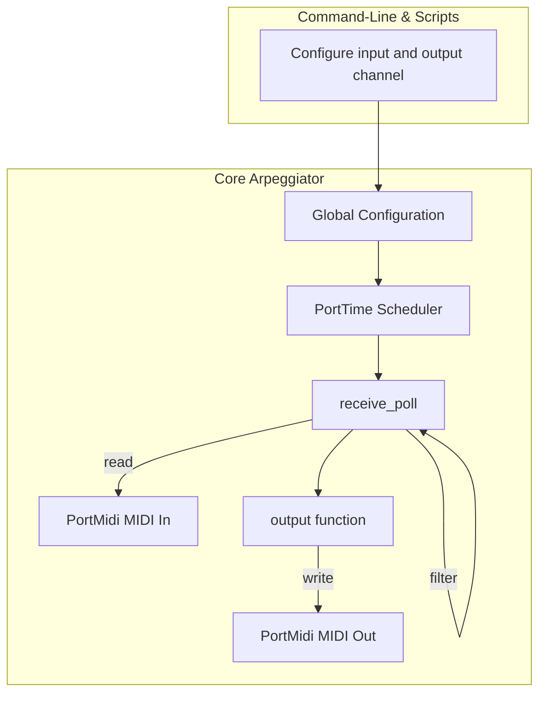
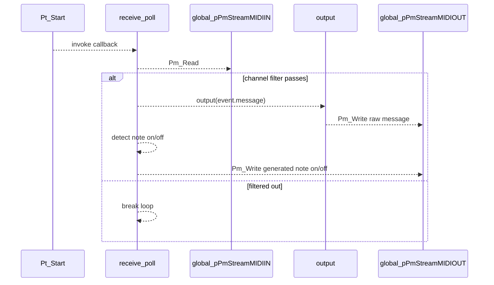

# Configuration and Automation (Command-Line & Scripts) – Input/Output MIDI Channels (Omni vs. Single Channel Filter) Feature Documentation

## Overview

This feature enables users to control which MIDI channels the arpeggiator listens to and which channel it uses for outgoing messages. By specifying an input channel, incoming MIDI events can be filtered so that only messages on that channel are processed; setting the input channel to –1 engages omni‐mode, allowing all channels through. Similarly, the configured output channel determines the channel number added to every generated MIDI message.

Users typically set `global_inputmidichannel` and `global_outputmidichannel` via command‐line arguments or automation scripts (`begin.ahk`/`end.ahk`). This filtering and channel remapping ensure that the arpeggiator can coexist with other MIDI applications and routes events precisely where they are needed.

## Architecture Overview



## Component Structure

### 1. Configuration Variables

Defined in **spimidiarpeggiator_polywin32.cpp**, these globals control channel filtering and remapping.

| Variable | Type | Description |
| --- | --- | --- |
| global_inputmidichannel | int | MIDI channel to accept (0–15). –1 for omni (no filtering). |
| global_outputmidichannel | int | MIDI channel for all outgoing messages (0–15). |


### 2. MIDI Input Filtering

#### **receive_poll** (`spimidiarpeggiator_polywin32.cpp`)

Purpose: Invoked by the PortTime callback to read pending MIDI events, apply channel filtering, and dispatch messages.

Key Steps:

1. Read a `PmEvent` from `global_pPmStreamMIDIIN`.
2. Extract the channel:

```cpp
   int chan = Pm_MessageStatus(event.message) & MIDI_CHN_MASK;
```

1. If `global_inputmidichannel` is between 0 and 15, ignore any event whose `chan` does not match:

```cpp
   if (global_inputmidichannel > -1 && global_inputmidichannel < 16) {
       if (chan != global_inputmidichannel) {
           break;
       }
   }
```

1. Pass matching events to the `output` function and handle note‐on/note‐off logic.

### 3. MIDI Output Channel Application

All generated messages use `Pm_Message` with a status byte offset of `0x90` (note on) plus the configured output channel:

```cpp
// Note On
tempPmEvent.message = Pm_Message(0x90 + global_outputmidichannel,
                                 notenumber,
                                 100);
Pm_Write(global_pPmStreamMIDIOUT, &tempPmEvent, 1);

// Note Off
tempPmEvent.message = Pm_Message(0x90 + global_outputmidichannel,
                                 notenumber,
                                 0);
Pm_Write(global_pPmStreamMIDIOUT, &tempPmEvent, 1);
```

This ensures that every arpeggiated note is sent on the exact channel specified by the user.

## Feature Flows

### 1. MIDI Event Processing Flow



## Dependencies

- PortMidi (MIDI I/O): functions like `Pm_Read`, `Pm_MessageStatus`, `Pm_MessageData1`, `Pm_Message`.
- PortTime (MIDI polling): `Pt_Start` schedules `receive_poll`.
- WinMM timers (for scheduling internal tasks).
- FreeImage (for UI background image loading) – not used in channel filtering.
- spiwavsetlib (status text and logging) – used for console output, not channel logic.

## Key Code Reference

| Identifier | File | Responsibility |
| --- | --- | --- |
| global_inputmidichannel | spimidiarpeggiator_polywin32.cpp | Stores the configured input channel filter (–1 = omni). |
| global_outputmidichannel | spimidiarpeggiator_polywin32.cpp | Stores the configured output channel for all generated notes. |
| receive_poll | spimidiarpeggiator_polywin32.cpp | Reads MIDI input, applies channel filter, dispatches events. |
| output | spimidiarpeggiator_polywin32.cpp | Forwards raw events to output device. |
| Pm_Message(0x90 + channel) | spimidiarpeggiator_polywin32.cpp | Constructs note on/off message with user‐specified channel. |
