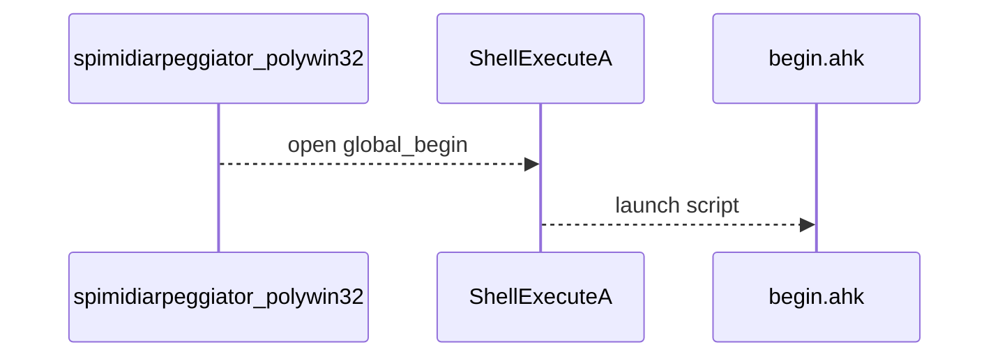

# Configuration and Automation Feature Documentation

## Overview

The **Configuration and Automation** feature enables automatic execution of external scripts at application startup and shutdown. By default, the application launches `begin.ahk` when it starts and `end.ahk` when it exits. This mechanism allows users to perform environment setup (for example, auto-routing virtual MIDI cables or initializing companion utilities) and cleanup tasks (such as resetting MIDI routings or closing auxiliary tools) without manual intervention.

Both script paths can be customized via command-line arguments, offering flexibility to integrate with diverse workflows or alternate scripting engines.

## Startup Automation

### Default Script

Upon application launch, the global variable `global_begin` is initialized to:

```cpp
string global_begin = "begin.ahk";
```

### Command-Line Override

If the user supplies at least 22 command-line arguments, the 21st argument (`argv[21]`) overrides the default startup script path:

```cpp
if (nArgs > 21) {
    global_begin = szArgList[21];
}
```

### Execution via ShellExecuteA

Immediately after argument parsing and before validating MIDI channels or creating the main window, the application launches the startup script using:

```cpp
ShellExecuteA(
    NULL, 
    "open", 
    global_begin.c_str(), 
    "", 
    NULL, 
    nCmdShow
);
```

#### Sequence Diagram



## Shutdown Automation

### Default Script

A corresponding global variable `global_end` is initialized to:

```cpp
string global_end = "end.ahk";
```

### Command-Line Override

If the user supplies at least 23 command-line arguments, the 22nd argument (`argv[22]`) overrides the default shutdown script path:

```cpp
if (nArgs > 22) {
    global_end = szArgList[22];
}
```

### Execution on Exit

When the main window receives `WM_DESTROY`, after cleaning up MIDI streams, timers, and graphics resources, the application launches the shutdown script:

```cpp
ShellExecuteA(
    NULL,
    "open",
    global_end.c_str(),
    "",
    NULL,
    0
);
PostQuitMessage(0);
```

#### Sequence Diagram


## Command-Line Arguments for Scripts

| Argument Index | Purpose | Default Value |
| --- | --- | --- |
| ---------------: | ------------------------------------ | --------------- |
| 21 | Path to startup automation script | begin.ahk |
| 22 | Path to shutdown automation script | end.ahk |


These positions follow a sequence of earlier parameters (MIDI devices, channels, tempo, window geometry, etc.) and allow precise control over which scripts are invoked.

## Typical Use Cases

- **Auto-routing MIDI cables:** Launch an AutoHotkey script to configure virtual MIDI ports or connect hardware controllers before the arpeggiator begins.
- **Starting companion tools:** Automatically open a DAW, launch a system monitor, or initialize logging utilities in the background.
- **Environment cleanup:** Reset audio driver settings or close helper applications when the arpeggiator exits.

By leveraging these hooks, users can embed the arpeggiator into larger automated performance or production setups with minimal manual steps.