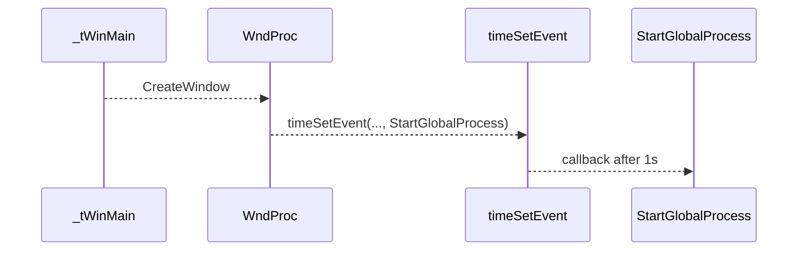
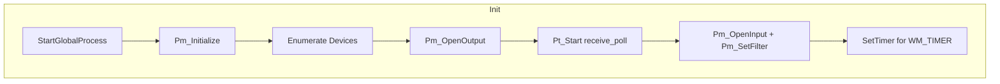
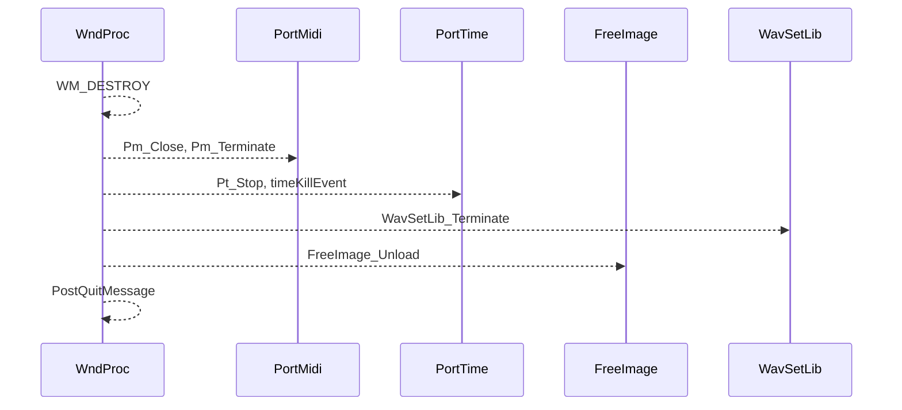

# Developer Notes (Build System and Code Pointers) – Runtime Lifecycle

This section outlines the high-level execution flow of the spimidiarpeggiator_polywin32 application from startup through MIDI I/O polling, timer-driven arpeggiation, and orderly shutdown. It highlights the key build-system settings and code pointers needed for maintainers to understand and modify the runtime lifecycle.

## Build System Pointers

- **Platform Toolset**: Visual Studio 2017 (v141)
- **Include Directories** (configured in spimidiarpeggiator_polywin32.vcxproj):

• ..\lib-src\portmidi\pm_common

• ..\lib-src\portmidi\porttime

• ..\lib-src\freeimage\Source

• ..\spiwavsetlib

- **Linked Libraries**:

• winmm.lib (for timeSetEvent / SetTimer)

• FreeImage.lib (image loading)

• spiwavsetlib_vs2017.lib (on-screen text & logging)

• portmidi_s.lib (MIDI I/O)

• portaudio_x86.lib / portaudio_x64.lib (optional audio I/O)

## Code Pointers

- **Main Source**: spimidiarpeggiator_polywin32.cpp
- **Win32 Resources**: spimidiarpeggiator_polywin32.rc
- **Project File**: spimidiarpeggiator_polywin32.vcxproj

All global state and core routines—including argument parsing, window message loop, MIDI setup, and cleanup—are implemented in spimidiarpeggiator_polywin32.cpp.

---

## Runtime Lifecycle

### 1. Application Startup

1. **Entry Point**

 via CommandLineToArgvA() and CommandLineToArgvW(). It then registers the window class, loads the background image with FreeImage, creates the main window, and enters the message loop.

1. **Schedule Initialization**

On WM_CREATE, WndProc invokes timeSetEvent to fire StartGlobalProcess once after 1 s (TIME_ONESHOT).

```c
   case WM_CREATE:
       global_timer = timeSetEvent(
           1000, 25,
           (LPTIMECALLBACK)&StartGlobalProcess,
           0,
           TIME_ONESHOT
       );
       break;
```



### 2. StartGlobalProcess (Initialization)

When the one-shot timer fires, StartGlobalProcess performs:

- **Log & UI Setup**

Opens output.txt, initializes spiwavsetlib for on-screen text and logging.

- **Random Seed**

Calls srand((unsigned)time(0)).

- **PortMidi Init & Device Enumeration**

Pm_Initialize();

Builds global_inputmididevicemap and global_outputmididevicemap via Pm_CountDevices()/Pm_GetDeviceInfo().

- **MIDI Output**

Pm_OpenOutput(&global_pPmStreamMIDIOUT, …);

- **PortTime Polling**

Pt_Start(1, receive_poll, 0);

- **MIDI Input**

Pm_OpenInput(&global_pPmStreamMIDIIN, …);

Pm_SetFilter(...);

Sets global_active = true.

- **Arpeggiator Timer**

Computes interval from global_tempo_bpm and calls SetTimer to generate WM_TIMER events.



### 3. MIDI Polling (PortTime Callback)

PortTime invokes receive_poll at ~1 ms intervals:

```c
void receive_poll(PtTimestamp timestamp, void* userData) {
    if (!global_active) return;
    while (Pm_Read(global_pPmStreamMIDIIN, &event, 1)) {
        output(event.message);
        // Detect NoteOn/Off, update global_notenumbermap or global_notenumberlist
        // Forward NoteOn/Off to global_pPmStreamMIDIOUT via Pm_Write
    }
}
```

• Filters by MIDI channel if global_inputmidichannel ≥ 0.

• Maintains note collections per program mode.

### 4. Arpeggiator Output (WM_TIMER)

Each WM_TIMER event (wParam == global_TimerId) fires the arpeggiation logic:

```c
case WM_TIMER:
    if (wParam == global_TimerId) {
        if (global_playflag) {
            // For each program (GOZILLA, ULTRAMAN, AVATAR, THOR):
            //   Send NoteOff then NoteOn for current note
            //   Advance iterator, wrap at end
        }
    }
    break;
```

• Interval = 60 000 ms / global_tempo_bpm.

• Uses Pm_Write to send MIDI events on global_pPmStreamMIDIOUT.

### 5. Shutdown Cleanup (WM_DESTROY)

When the window is destroyed:

1. KillTimer(NULL, global_TimerId)
2. Send pending NoteOff for all notes
3. Pm_Close(global_pPmStreamMIDIIN/OUT)
4. Pt_Stop(); Pm_Terminate()
5. Close output.txt
6. WavSetLib_Terminate()
7. timeKillEvent(global_timer)
8. FreeImage_Unload(global_dib); DeleteObject(global_hFont)
9. PostQuitMessage(0)



---

Maintainers can use these pointers to trace and adjust the startup sequence, MIDI I/O handling, timer scheduling, and teardown process within spimidiarpeggiator_polywin32.cpp.