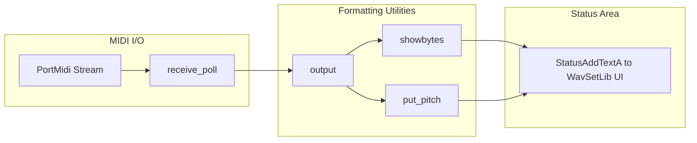
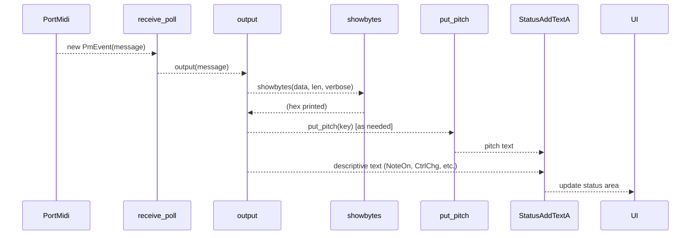

# Logging, Status Output, and Diagnostics – MIDI Event Monitor Output

## Overview

The MIDI Event Monitor Output feature provides real-time visibility into incoming MIDI data by printing both raw hexadecimal bytes and human-readable interpretations of MIDI messages (notes, controllers, program changes, system real-time, and SysEx) to the application’s on-screen status area. This capability aids in diagnosing MIDI connectivity issues, verifying controller mappings, and understanding message flows when configuring or troubleshooting external MIDI devices.

Under the hood, the monitor leverages three core formatting utilities—`showbytes()`, `put_pitch()`, and `output()`—to decode `PmMessage` data from PortMidi, format it, and dispatch the resulting text to the status control via `StatusAddTextA`. A set of global verbosity flags governs which categories of messages are displayed in detail.

## Architecture Overview

## Utility Functions

### put_pitch

- **Signature:** `static int put_pitch(int p)`
- **Responsibility:** Converts a MIDI note number `p` into its pitch name and octave (e.g., 60 → “c4”), writes it to the status area, and returns the character count of the printed name.
- **Behaviour:**
- Indexes into `ptos[]` for the note name.
- Calculates octave as `(p/12) - 1`.
- Formats the result into `pCHAR` and calls `StatusAddTextA`.
- Returns `strlen(result)`.
- **Reference:**

### showbytes

- **Signature:** `static void showbytes(PmMessage data, int len, bool newline)`
- **Responsibility:** Emits the raw MIDI message bytes in hexadecimal notation to `stdout`, preceding with a newline if `newline` is true (currently disabled), truncating with “…” after 72 characters.
- **Behaviour:**
- Iterates up to `len` bytes, printing two hex characters per byte via `putchar`.
- Tracks total characters; if exceeding 72, prints “…” and stops.
- Appends a space after the hex dump.
- **Reference:**

### output

- **Signature:** `static void output(PmMessage data)`
- **Responsibility:** Interprets a single `PmMessage` according to its MIDI status byte, prints raw bytes via `showbytes()`, and, if enabled by flags, prints a human-readable description (e.g., “NoteOn Chan  0 Key  38 c2 Vel 56”) to the status area.
- **Behaviour Overview:**
- Extracts `command = Pm_MessageStatus(data) & MIDI_CODE_MASK` and `chan = … & MIDI_CHN_MASK`.
- Handles **System Exclusive** if `in_sysex` or status == `MIDI_SYSEX`.
- Scans for `MIDI_EOX`, calls `showbytes(data, i, verbose)`, then prints “System Exclusive”.
- Handles **Note On/Off** (`MIDI_ON_NOTE`, `MIDI_OFF_NOTE`), **Program Change**, **Control Change** (including channel mode), **Aftertouch**, **Pitch Bend**, and **System Real-Time** messages (Song Position, Song Select, Tune Request, Time Code, Start/Continue/Stop, System Reset, Clock, Active Sensing).
- For each case:
- Calls `showbytes` with appropriate byte count.
- If the corresponding global flag (e.g., `notes`, `pgchanges`, `chmode`, `bender`, `realdata`) is true  `verbose` is true, formats and sends descriptive text via `StatusAddTextA`.
- Flushes `stdout` at the end.
- **Reference:**

## Verbosity and Filter Flags

The following global booleans control which messages and details appear in the monitor:

| Flag | Description |
| --- | --- |
| in_sysex | Currently parsing a System Exclusive message |
| notes | Enable Note On/Off reporting |
| controls | Enable continuous controller messages |
| bender | Enable aftertouch and pitch bend messages |
| excldata | Record system exclusive data |
| verbose | Show human-readable text descriptions after hex dump |
| realdata | Show system real-time messages (Start, Stop, Clock, etc.) |
| clksencnt | Count Clock & Active Sensing bytes instead of printing them |
| chmode | Enable channel mode controller messages (Omni On/Off, All Sound Off, etc.) |
| pgchanges | Enable Program Change reporting |
| flush | Flush pending MIDI data |
| filter | Bitmask for PortMidi channel filtering |

- **Reference for flag declarations:**

## MIDI Event Monitoring Flow

## Key Utilities Reference

| Function | Responsibility |
| --- | --- |
| showbytes | Print raw MIDI bytes in hex with optional truncation |
| put_pitch | Convert MIDI note number to pitch name and send to status |
| output | Dispatch formatted MIDI message (hex + text) to status |

---

This documentation covers the built-in formatting utilities and flag-driven verbosity that drive the MIDI Event Monitor Output feature. Adjusting the global flags at runtime allows developers or advanced users to tailor the level of detail shown during MIDI diagnostics.