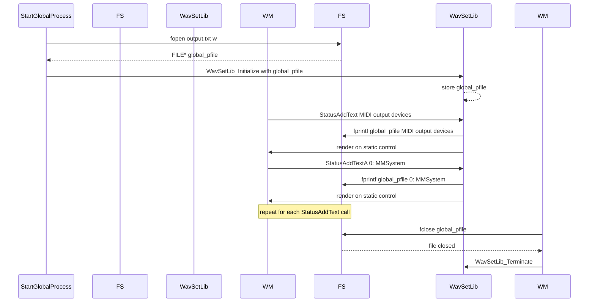

# Logging, Status Output, and Diagnostics – Session Logging to output.txt

## Overview

The spimidiarpeggiator_polywin32 application mirrors all on-screen status and diagnostic messages to a plain-text log file named **output.txt**. By opening a writable FILE* and passing it into the external **spiwavsetlib** library via **WavSetLib_Initialize**, every call to `StatusAddText` or `StatusAddTextA` writes not only to the UI’s static control but also appends the same text to **output.txt**. This dual-output mechanism:

- Provides a persistent record of device enumeration, selection, and runtime events (e.g., MIDI messages, play/pause toggles).
- Facilitates post-mortem analysis and troubleshooting without requiring screen capture.
- Ensures developers and advanced users can inspect the full session transcript in the working directory.

## File Initialization and Lifecycle

### Opening output.txt

When the application’s main processing loop is started (`StartGlobalProcess` callback), **output.txt** is opened for writing and its FILE pointer is stored in the global variable `global_pfile`:

```cpp
global_pfile = fopen("output.txt","w");
WavSetLib_Initialize(global_hwnd,
                     IDC_MAIN_STATIC,
                     global_staticwidth,
                     global_staticheight,
                     global_fontwidth,
                     global_fontheight,
                     global_staticalignment,
                     global_pfile);
```

– The call to `fopen("output.txt","w")` truncates any existing log and prepares a fresh session log .

– Passing `global_pfile` into `WavSetLib_Initialize` instructs **spiwavsetlib** to route every subsequent status output to this file in addition to the UI.

### Integration with spiwavsetlib

Internally, **spiwavsetlib** retains the provided FILE* handle and augments its `StatusAddText`/`StatusAddTextA` functions to perform:

1. **On-screen display**: Text is rendered into the window’s static control (via Win32 GDI/TextOut).
2. **File logging**: The exact same ANSI or wide-char text is written to **output.txt** using `fprintf`, ensuring a byte-for-byte record of the session.

All status messages—ranging from device listings to runtime state changes—are thus duplicated without requiring any additional calls in the core application code.

### Closing the File

Upon application shutdown (handling of `WM_DESTROY`), the file is closed cleanly before terminating the WAV-set library:

```cpp
if (global_pfile)
    fclose(global_pfile);
WavSetLib_Terminate();
```

This guarantees all buffered output is flushed and the file descriptor is released .

## Log Contents

A typical **output.txt** session log includes, but is not limited to:

- **Device enumeration**

• Lists of available MIDI output and input devices with their indices, interfaces, and names (e.g., “0: MMSystem, Microsoft MIDI Mapper”)

• Mapping from human-readable names to PortMidi device IDs.

- **Selection confirmation**

• Lines such as “device 13 selected” and “device 11 selected”.

- **Connection state markers**

• Star-delimited banners for connection events:

```plaintext
    *************************
    midi input port CONNECTED
    *************************
```

- **Play/pause toggles**

• “play” / “pause” messages upon space-bar presses.

- **MIDI event transcripts**

• Formatted text for NoteOn/NoteOff, program changes, control changes, and real-time messages, for example:

```plaintext
    NoteOn  Chan  0 Key  38 d2  Vel 56
    NoteOff Chan  0 Key  38 d2  Vel 64
```

All entries appear in chronological order, reflecting exactly what the user sees on-screen.

## File Location

- **Working Directory**: **output.txt** is created in the current working directory from which the GUI executable is launched.

– If run from Visual Studio, this is typically the project’s Debug or Release folder.

– When double-clicking the built .exe, it will appear alongside the .exe in its folder.

## Session Logging Sequence



This flow ensures that every call to `StatusAddText` is both displayed and logged for full diagnostic traceability.

---

By centralizing log output through **spiwavsetlib**’s file handle, spimidiarpeggiator_polywin32 provides a robust, synchronized mechanism for capturing session-wide diagnostics in **output.txt**, aiding deep troubleshooting and user support.