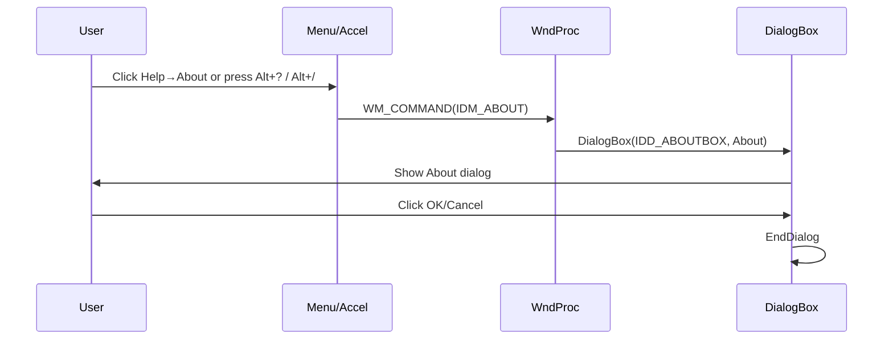

# Reference: Controls, Menus, and Resources – Keyboard and Menu Commands

## Overview

This section documents how the spimidiarpeggiator_polywin32 application exposes its Exit and About commands via the menu bar and keyboard accelerators. Users can select **File → Exit** to close the application or **Help → About** to view version and copyright information. Two accelerator keys (Alt+? and Alt+/) also invoke the About dialog. The visibility of these commands depends on whether the window is created with a standard title–menu bar (controlled by the `global_titlebardisplay` flag).

## Menu Resources

### Menu Structure

The main menu is defined in **spimidiarpeggiator_polywin32.rc** under the menu resource **IDC_SPIWAVWIN32**:

```rc
IDC_SPIWAVWIN32 MENU
BEGIN
    POPUP "&File"
    BEGIN
        MENUITEM "E&xit",                       IDM_EXIT
    END
    POPUP "&Help"
    BEGIN
        MENUITEM "&About .",                  IDM_ABOUT
    END
END
```

### Resource Identifiers

| Identifier | Value | Defined In | Description |
| --- | --- | --- | --- |
| IDC_SPIWAVWIN32 | 109 | resource.h | Menu resource block |
| IDM_EXIT | 105 | resource.h | Triggers application shutdown |
| IDM_ABOUT | 104 | resource.h | Opens the About dialog |


### Command Handling

In **spimidiarpeggiator_polywin32.cpp**, the `WM_COMMAND` case in `WndProc` dispatches these menu commands:

```cpp
case WM_COMMAND:
    wmId = LOWORD(wParam);
    switch (wmId) {
    case IDM_ABOUT:
        DialogBox(hInst, MAKEINTRESOURCE(IDD_ABOUTBOX), hWnd, About);
        break;
    case IDM_EXIT:
        DestroyWindow(hWnd);
        break;
    default:
        return DefWindowProc(hWnd, message, wParam, lParam);
    }
    break;
```

## Accelerator Keys

Two accelerators map Alt+? and Alt+/ to the About command. They are defined in the same resource script:

```rc
IDC_SPIWAVWIN32 ACCELERATORS
BEGIN
    "?",            IDM_ABOUT,              ASCII,  ALT
    "/",            IDM_ABOUT,              ASCII,  ALT
END
```

| Key Combination | Triggers | Description |
| --- | --- | --- |
| Alt + ? | IDM_ABOUT | Open the About dialog |
| Alt + / | IDM_ABOUT | Open the About dialog |


When the Win32 message loop calls `TranslateAccelerator`, pressing either combination generates a `WM_COMMAND` with `IDM_ABOUT`.

## About Dialog

### Dialog Resource

Also in **spimidiarpeggiator_polywin32.rc**, the About dialog is defined under **IDD_ABOUTBOX**:

```rc
IDD_ABOUTBOX DIALOGEX 0, 0, 170, 62
STYLE DS_SETFONT | DS_MODALFRAME | DS_FIXEDSYS | WS_POPUP | WS_CAPTION | WS_SYSMENUCAPTION
"About spiwavwin32"
FONT 8, "MS Shell Dlg", 0, 0, 0x1
BEGIN
    ICON            128,IDC_STATIC,14,14,21,20
    LTEXT           "spiwavwin32, Version 1.0",IDC_STATIC,42,14,114,8,SS_NOPREFIX
    LTEXT           "Copyright (C) 2012",     IDC_STATIC,42,26,114,8
    DEFPUSHBUTTON   "OK",                     IDOK,   113,41,50,14,WS_GROUP
END
```

| Control Type | Text | Control ID |
| --- | --- | --- |
| ICON | (App icon, 21×20) | IDC_STATIC |
| LTEXT | spiwavwin32, Version 1.0 | IDC_STATIC |
| LTEXT | Copyright (C) 2012 | IDC_STATIC |
| DEFPUSHBUTTON | OK | IDOK |


### Dialog Procedure

The About dialog procedure in **spimidiarpeggiator_polywin32.cpp** handles initialization and dismissal:

```cpp
INT_PTR CALLBACK About(HWND hDlg, UINT message, WPARAM wParam, LPARAM lParam)
{
    UNREFERENCED_PARAMETER(lParam);
    switch (message)
    {
    case WM_INITDIALOG:
        return (INT_PTR)TRUE;
    case WM_COMMAND:
        if (LOWORD(wParam) == IDOK || LOWORD(wParam) == IDCANCEL)
        {
            EndDialog(hDlg, LOWORD(wParam));
            return (INT_PTR)TRUE;
        }
        break;
    }
    return (INT_PTR)FALSE;
}
```

## Menu Availability Toggle

The boolean `global_titlebardisplay` controls whether the main window is created with a standard frame (including its menu bar) or as a borderless popup:

```cpp
if (global_titlebardisplay)
{
    // Standard window with title bar and menu
    hWnd = CreateWindow(szWindowClass, szTitle, WS_OVERLAPPEDWINDOW, …);
}
else
{
    // No title bar, no menu
    hWnd = CreateWindow(szWindowClass, szTitle, WS_POPUP | WS_VISIBLE, …);
}
```

- **WS_OVERLAPPEDWINDOW** includes `WS_CAPTION`, `WS_SYSMENU` and the menu bar, making File→Exit and Help→About accessible.
- **WS_POPUP** omits these styles, so the menu bar—and thus Exit/About—are hidden.

## Interaction Sequence



## Key Components Reference

| Component | Responsibility |
| --- | --- |
| spimidiarpeggiator_polywin32.rc | Defines menu bar, accelerators, About dialog |
| resource.h | Declares `IDC_SPIWAVWIN32`, `IDM_EXIT`, `IDM_ABOUT`, `IDD_ABOUTBOX` |
| spimidiarpeggiator_polywin32.cpp | Implements `WM_COMMAND` handling and `About` proc |
| About (Dialog Procedure) | Manages About dialog lifecycle |
