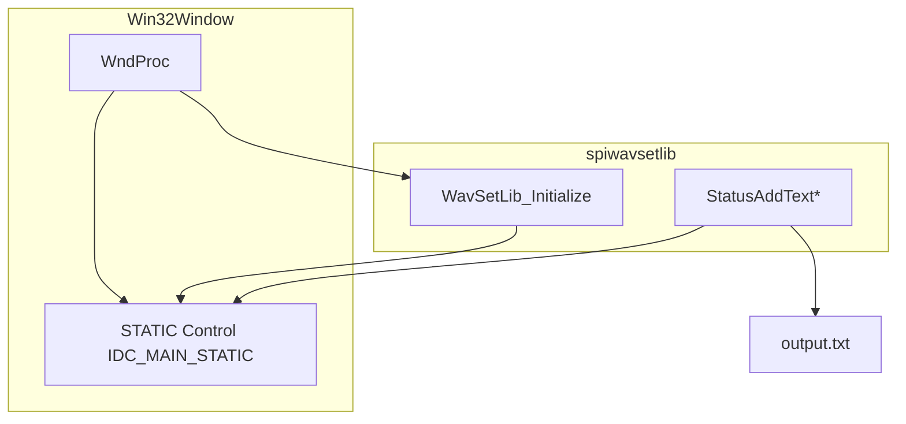
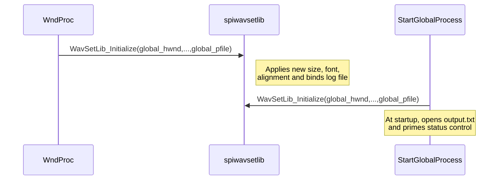

# UI and Visual Customization – On-Screen Status Text (Font, Color, Alignment)

## Overview

This feature overlays real-time status messages—such as MIDI events and control text—directly on the application window using a transparent Win32 STATIC control. It supports:

– Custom font size and computed average character width for consistent layout

– RGB color configuration for readable text over any background

– Horizontal alignment (left, center, right) via control style bits

– Dynamic resizing and re-initialization on window size changes

– Integration with an external library (spiwavsetlib) for text rendering and logging

Together, these capabilities provide clear, customizable feedback to the user without obstructing the background visuals.

## Architecture Overview

## Component Structure

### 1. Presentation Layer

#### **WndProc** (spimidiarpeggiator_polywin32.cpp)

Purpose

Handle Win32 messages to create, style, and update the on-screen status text control.

Key Global Variables

| Name | Type | Description |
| --- | --- | --- |
| global_hFont | HFONT | Font handle created with height = global_fontheight |
| global_fontheight | int | Requested font height in pixels (default 24) |
| global_fontwidth | int | Computed average character width (set in WM_PAINT) |
| global_fontcolor_r/g/b | BYTE | RGB components for text color (default 255,255,255) |
| global_staticalignment | int | Horizontal alignment: 0=left, 1=center, 2=right |
| global_staticwidth | int | Control width (client width) |
| global_staticheight | int | Control height (client height) |
| global_pfile | FILE* | Log file pointer passed to spiwavsetlib |

Key Message Handlers

• WM_CREATE

– Create a transparent STATIC control with style bits including the alignment mask

– Set its font to global_hFont via WM_SETFONT

– Kick off a one-shot timer that calls StartGlobalProcess

• WM_SIZE

– Recompute global_staticwidth and global_staticheight from the new client RECT

– Call WavSetLib_Initialize with updated size, font metrics, alignment, and log file

– Move/resize the STATIC control to fill the client area

• WM_CTLCOLORSTATIC

– Make the STATIC background transparent (`SetBkMode TRANSPARENT`)

– Apply the configured text color via `SetTextColor(..., RGB(global_fontcolor_r, global_fontcolor_g, global_fontcolor_b))`

– Return a NULL pen to suppress default borders

### 2. Infrastructure Service

#### **spiwavsetlib** Integration

An external native library that renders text into the STATIC control and mirrors each message to a log file.

Public API

| Function | Description |
| --- | --- |
| WavSetLib_Initialize | Configure control dimensions, font metrics, alignment, and log target |
| StatusAddText / StatusAddTextA/W | Append a line of text to the control and to output.txt |

Initialization & Lifecycle

- On first window sizing (WM_SIZE), `WavSetLib_Initialize(global_hwnd, IDC_MAIN_STATIC, global_staticwidth, global_staticheight, global_fontwidth, global_fontheight, global_staticalignment, global_pfile)`
- On application start (timer callback `StartGlobalProcess`), reopen `output.txt` and re-initialize the library with the same parameters
- On shutdown (WM_DESTROY), call `WavSetLib_Terminate()` to clean up internal resources

Data Flow

1. **WndProc WM_SIZE** → calls → **WavSetLib_Initialize** (resizes/redraws control)
2. **StartGlobalProcess** → calls → **WavSetLib_Initialize** (initializes text window, log file)
3. Various MIDI handlers → call → **StatusAddText*** → updates STATIC control and logs to `output.txt`

## Key Components Reference

| Component | Responsibility |
| --- | --- |
| WndProc | Manages creation, styling, and updates of the STATIC control |
| spiwavsetlib (external) | Renders on-screen text and logs messages to `output.txt` |

---

This section covers every aspect of how the application displays and customizes its on-screen status text—defining font, color, alignment, dynamic resizing, and integration with the spiwavsetlib infrastructure for rendering and logging.