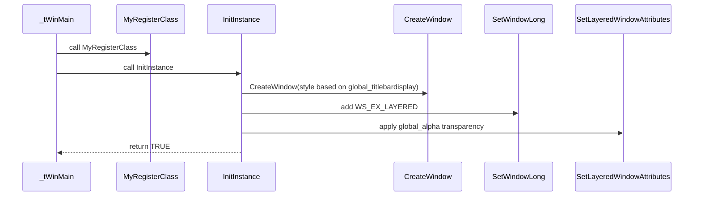

# UI and Visual Customization (Window Geometry, Transparency, and Decorations)

## Overview

This section describes how the application initializes and configures its main window’s position, size, transparency, and decorations (title bar and menu). Through a set of global parameters (modifiable via command-line or defaults), the user or integrator can control:

- Window geometry (origin and dimensions)
- Alpha transparency level
- Presence of title bar and menu bar

These settings are applied during application startup in the `MyRegisterClass` and `InitInstance` functions, ensuring that the window appears exactly as configured before entering the main message loop.

## Window Geometry Parameters

Several global variables define the window’s position and size. They are initialized with default values and can be overridden by command-line arguments before window creation:

| Parameter | Description | Default Value |
| --- | --- | --- |
| `global_x` | Horizontal (X) coordinate of the window | 100 |
| `global_y` | Vertical (Y) coordinate of the window | 200 |
| `global_xwidth` | Width of the window in pixels | 400 |
| `global_yheight` | Height of the window in pixels | 400 |
| `global_alpha` | Opacity level (0 = transparent, 255 = opaque) | 200 |
| `global_titlebardisplay` | Show title bar (1 = on, 0 = off) | 1 |
| `global_menubardisplay` | Show menu bar (1 = on, 0 = off) | 0 |


These defaults are declared in the global scope of **spimidiarpeggiator_polywin32.cpp** .

## Window Class Registration (MyRegisterClass)

Before creating the window, the application registers a window class (`szWindowClass`) with Windows. In `MyRegisterClass`, a `WNDCLASSEX` structure is populated:

- **Style Flags**: `CS_HREDRAW | CS_VREDRAW`
- **Window Procedure**: `WndProc`
- **Icons**:
- Large icon loaded from `background_32x32x16.ico`
- Small icon loaded from `background_16x16x16.ico`
- **Cursor**: Standard arrow (`IDC_ARROW`)
- **Background Brush**: System window color (`COLOR_WINDOW+1`)
- **Menu**: Attached only if `global_menubardisplay == 1`; otherwise `NULL`
- **Class Name**: `szWindowClass`

```cpp
WNDCLASSEX wcex;
wcex.cbSize        = sizeof(WNDCLASSEX);
wcex.style         = CS_HREDRAW | CS_VREDRAW;
wcex.lpfnWndProc   = WndProc;
wcex.cbClsExtra    = 0;
wcex.cbWndExtra    = 0;
wcex.hInstance     = hInstance;
wcex.hIcon         = (HICON)LoadImage(NULL, L"background_32x32x16.ico", IMAGE_ICON, 0, 0, LR_LOADFROMFILE);
wcex.hCursor       = LoadCursor(NULL, IDC_ARROW);
wcex.hbrBackground = (HBRUSH)(COLOR_WINDOW+1);
wcex.lpszMenuName  = global_menubardisplay ? MAKEINTRESOURCE(IDC_SPIWAVWIN32) : NULL;
wcex.lpszClassName = szWindowClass;
wcex.hIconSm       = (HICON)LoadImage(NULL, L"background_16x16x16.ico", IMAGE_ICON, 0, 0, LR_LOADFROMFILE);
RegisterClassEx(&wcex);
```

This registration ensures that when windows of this class are created, they inherit the specified icons, cursor, background, and optional menu .

## Window Creation and Initialization (InitInstance)

In `InitInstance`, the application:

1. Stores the module handle in `hInst`.
2. Loads the background image via FreeImage (for painting).
3. Creates a fixed-width font (`SYSTEM_FIXED_FONT`) at height `global_fontheight`.
4. Chooses window style based on `global_titlebardisplay`:
5. **With Title Bar**: `WS_OVERLAPPEDWINDOW`
6. **Borderless**: `WS_POPUP | WS_VISIBLE`
7. Calls `CreateWindow`, passing `global_x`, `global_y`, `global_xwidth`, and `global_yheight`.
8. Applies layered window attributes for transparency.
9. Shows and updates the window.

```cpp
if (global_titlebardisplay) {
    hWnd = CreateWindow(szWindowClass, szTitle, WS_OVERLAPPEDWINDOW,
        global_x, global_y, global_xwidth, global_yheight,
        NULL, NULL, hInstance, NULL);
} else {
    hWnd = CreateWindow(szWindowClass, szTitle, WS_POPUP | WS_VISIBLE,
        global_x, global_y, global_xwidth, global_yheight,
        NULL, NULL, hInstance, NULL);
}
if (!hWnd) return FALSE;
global_hwnd = hWnd;

// Enable layering for alpha transparency
SetWindowLong(hWnd, GWL_EXSTYLE,
    GetWindowLong(hWnd, GWL_EXSTYLE) | WS_EX_LAYERED);
SetLayeredWindowAttributes(hWnd, 0, global_alpha, LWA_ALPHA);

ShowWindow(hWnd, nCmdShow);
UpdateWindow(hWnd);
```

This sequence guarantees that the window appears at the specified location and size, with or without standard decorations, and rendered with the configured transparency .

## Layered Window and Transparency

To achieve per-window opacity, the extended style `WS_EX_LAYERED` is set on the created window, and `SetLayeredWindowAttributes` is invoked:

- **Color Key**: `0` (unused)
- **Alpha**: `global_alpha` (0–255)
- **Flags**: `LWA_ALPHA`

```cpp
SetWindowLong(hWnd, GWL_EXSTYLE,
    GetWindowLong(hWnd, GWL_EXSTYLE) | WS_EX_LAYERED);
SetLayeredWindowAttributes(hWnd, 0, global_alpha, LWA_ALPHA);
```

This makes the entire window (including background image and static controls) translucent according to `global_alpha` .

## Initialization Sequence



This diagram outlines the startup flow from program entry to the visible, translucent window.

## Key Functions Reference

| Function | Responsibility |
| --- | --- |
| `MyRegisterClass` | Registers window class, sets icons, cursor, background, and menu |
| `InitInstance` | Creates main window with configured geometry, style, and transparency |
| `SetWindowLong` | Applies `WS_EX_LAYERED` extended style for transparency |
| `SetLayeredWindowAttributes` | Sets the per-window alpha level using `global_alpha` |
