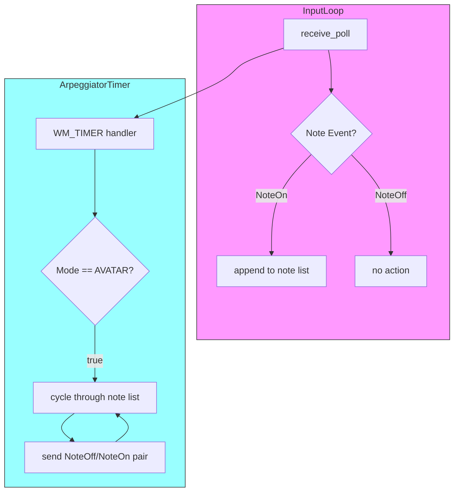
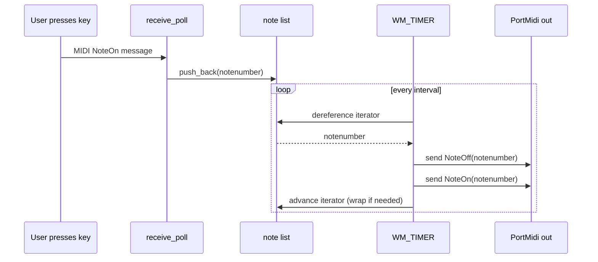

# Using the Arpeggiator (Core User Workflows) – Arpeggiation Modes: AVATAR

## Overview

The AVATAR arpeggiation mode provides a round-robin cycling through all currently held MIDI notes in the order they were received. When the user holds one or more keys on the MIDI input device, each NoteOn event is appended to an internal list. A Win32 timer then iterates over that list, turning each note off and on in sequence to produce a continuous, looping arpeggio. Unlike the GOZILLA mode, AVATAR does  remove notes from its list when a NoteOff event is received; notes remain until the user manually stops playback or re-selects a different mode.

This mode is ideal for simple “up” patterns where the order of key presses defines the arpeggio sequence. It ensures that even if the user releases a key, its pitch continues participating in the cycle, preserving the original rhythmic and melodic contour until playback ends.

## Architecture Overview



## Component Structure

### spimidiarpeggiator_polywin32.cpp

- Purpose: Implements the main Win32 message loop, MIDI I/O handling (via PortMidi), arpeggiator timer callback, and per-mode arpeggiation logic.
- Key Globals:
- `std::vector<int> global_notenumberlist`

Holds the sequence of active note numbers for AVATAR and THOR modes.

- `std::vector<int>::iterator global_listit`

Iterator into `global_notenumberlist` used by AVATAR and THOR to track the current note.

- `int global_programid`

Indicates the selected arpeggiation mode (`PROGRAM_AVATAR` for AVATAR).

- `bool global_playflag`

When true, the timer callback emits notes; when false, the timer idles.

- `UINT_PTR global_TimerId`

Identifier for the Win32 timer used to schedule arpeggio steps.

- `PmStream *global_pPmStreamMIDIOUT`

PortMidi output stream for sending NoteOn/NoteOff messages.

- `int global_outputmidichannel`

MIDI channel offset for output messages.

## AVATAR Mode Details

### Note Storage

- Structure:

AVATAR uses `global_notenumberlist` (a `std::vector<int>`) as its sole note container.

- Insertion Logic (inside `receive_poll` upon NoteOn):

```cpp
  // when msgstatus indicates NoteOn with nonzero velocity
  global_notenumberlist.push_back(notenumber);
  global_listit = global_notenumberlist.begin();
```

- No removal on NoteOff:

In the NoteOff handling branch, AVATAR’s code block is empty – no erasure occurs.

### Timer-Driven Output

Within the `WM_TIMER` message handler:

```cpp
case WM_TIMER:
  if(wParam == global_TimerId && global_playflag) {
    if(global_programid == PROGRAM_AVATAR) {
      if(global_notenumberlist.size() > 0) {
        int notenumber = *global_listit;
        // send note off
        tempPmEvent.timestamp = 0;
        tempPmEvent.message = Pm_Message(0x90 + global_outputmidichannel, notenumber, 0);
        Pm_Write(global_pPmStreamMIDIOUT, &tempPmEvent, 1);
        // send note on
        tempPmEvent.timestamp = 0;
        tempPmEvent.message = Pm_Message(0x90 + global_outputmidichannel, notenumber, 100);
        Pm_Write(global_pPmStreamMIDIOUT, &tempPmEvent, 1);
        // advance iterator
        ++global_listit;
        if(global_listit == global_notenumberlist.end()) {
          global_listit = global_notenumberlist.begin();
        }
      }
    }
    // other modes…
  }
  break;
```

- On each timer tick, fetch the current note via `*global_listit`.
- Always send an explicit NoteOff before the corresponding NoteOn to retrigger the note envelope.
- Advance `global_listit`, wrapping to the beginning when the end is reached.

### NoteOff Handling

```cpp
else if((msgstatus >= MIDI_ON_NOTE && msgstatus < MIDI_ON_NOTE+16 && Pm_MessageData2(event.message)==0)
      || (msgstatus >= MIDI_OFF_NOTE && msgstatus < MIDI_OFF_NOTE+16))
{
  if(global_programid == PROGRAM_AVATAR) {
    // Intentionally empty: AVATAR retains notes on NoteOff
  }
  // other modes handle removal here…
}
```

- Incoming NoteOff (or NoteOn with zero velocity)  alter `global_notenumberlist`.
- Notes remain in the cycle until playback stops or the list is explicitly cleared by changing modes or stopping.

## Sequence Diagram



## Dependencies

- **PortMidi / PortTime**

Used for non-blocking MIDI input polling (`receive_poll`) and output (`Pm_Write`).

- **WinMM Timers**

Schedules the WM_TIMER events driving the arpeggio step.

- **spiwavsetlib**

Renders on-screen status text and logs to `output.txt`.

- **FreeImage**

Loads a background image for the application window.

## Testing Considerations

- Verify that holding multiple keys results in a continuous cycle through all notes in press order.
- Confirm that releasing keys does  truncate the cycle in AVATAR mode.
- Test timer wrap-around: after the last list element, ensure the iterator returns to the start.
- Check that switching to another mode (e.g., GOZILLA) clears or repopulates note containers appropriately.

## Key Code References

| Component | Responsibility |
| --- | --- |
| spimidiarpeggiator_polywin32.cpp | Core Win32 loop, MIDI I/O, timer callbacks, and AVATAR logic |
| global_notenumberlist (std::vector) | Stores active notes in order of reception for AVATAR & THOR modes |
| global_listit (vector<int>::iterator) | Tracks current position in `global_notenumberlist` |
| receive_poll (in spimidiarpeggiator…) | Reads MIDI input, dispatches NoteOn to list, filters by channel |
| WM_TIMER handler (in spimidiarpeggiator…) | Drives arpeggio output based on selected mode and timer events |


This documentation covers the AVATAR arpeggiation mode’s core workflow: how notes are captured, stored, and cycled through via a Win32 timer without removal on release.