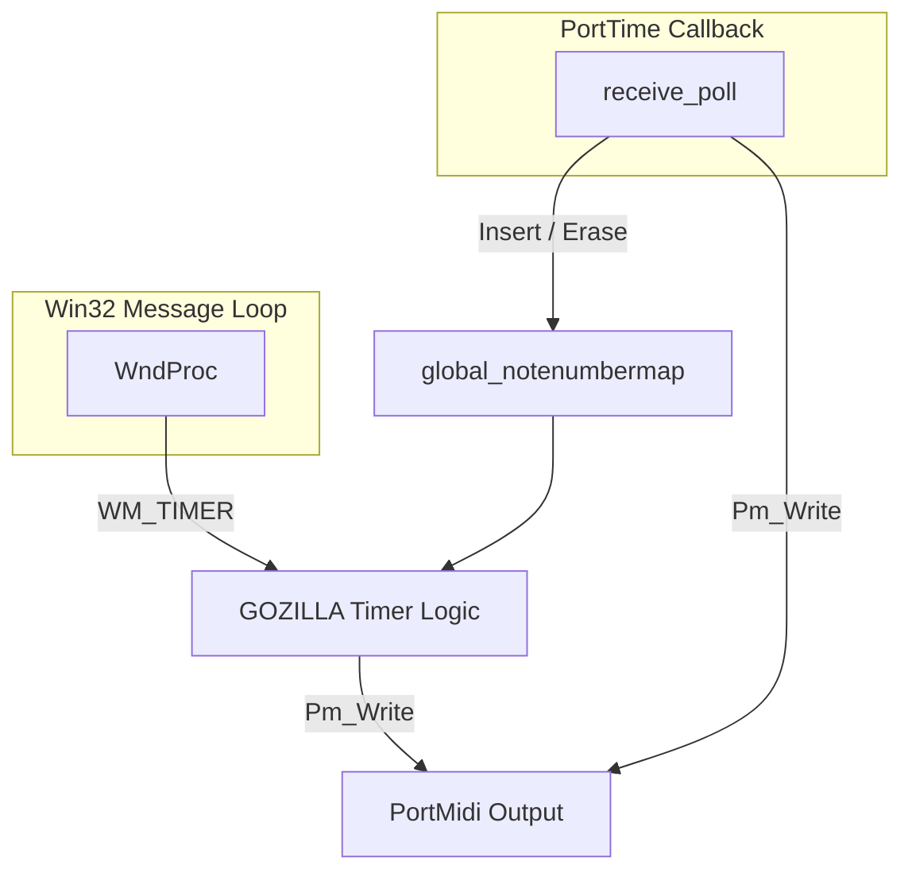
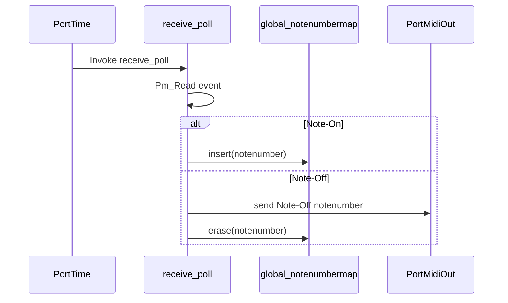
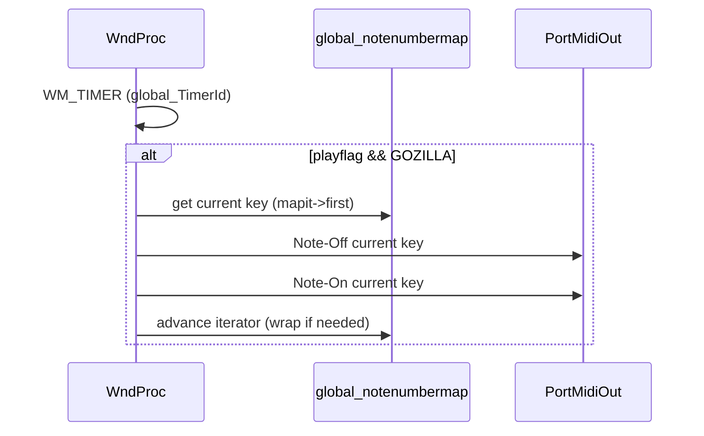

# Using the Arpeggiator – Arpeggiation Modes: GOZILLA

## Overview

GOZILLA is a map-based MIDI arpeggiation mode in *spimidiarpeggiator_polywin32*. When the user plays notes on the MIDI input device, GOZILLA:

- Inserts each incoming Note-On into an ordered `std::map<int,int>`, ensuring unique note entries.
- On Note-Off, immediately sends a corresponding Note-Off for that pitch and removes it from the map.
- On each timer tick (WM_TIMER), iterates the map in ascending key order, sending Note-Off then Note-On for each stored note in turn, creating a repeating arpeggio.

This mode guarantees that each pitch appears only once in the cycle and that releasing a key instantly removes it from the pattern. GOZILLA is ideal for players who want strict round-robin cycling over held notes with immediate release behavior.

## Architecture Overview



## Component Structure

### Global Variables

Defined in **spimidiarpeggiator_polywin32.cpp** :

| Variable | Type | Description |
| --- | --- | --- |
| `global_notenumbermap` | `std::map<int,int>` | Holds active note pitches (key = pitch). |
| `global_mapit` | `std::map<int,int>::iterator` | Current iterator into `global_notenumbermap`. |
| `global_programid` | `int` | Selected mode (0 = GOZILLA, 1 = ULTRAMAN, …). |
| `global_outputmidichannel` | `int` | MIDI channel for outgoing notes (0–15). |
| `global_TimerId` | `UINT` | Identifier for the Win32 timer event. |
| `global_playflag` | `bool` | True when arpeggiator is running. |


### receive_poll (MIDI Input Processing)

**Location:** `void receive_poll(PtTimestamp, void*)` in **spimidiarpeggiator_polywin32.cpp**

**Purpose:** Reads incoming MIDI events, echoes them, and for GOZILLA manages the note map on Note-On/Off.

Key behavior for GOZILLA:

1. On Note-On (status ≥ MIDI_ON_NOTE && velocity > 0):

```cpp
   global_notenumbermap.insert(pair<int,int>(notenumber,0));
   global_mapit = global_notenumbermap.begin();
```

1. On Note-Off (status indicates Note-Off or Note-On with velocity = 0):

```cpp
   // send immediate Note-Off to output
   PmEvent tempPmEvent;
   tempPmEvent.message = Pm_Message(0x90+global_outputmidichannel, notenumber, 0);
   Pm_Write(global_pPmStreamMIDIOUT, &tempPmEvent, 1);

   // remove from map
   global_mapit = global_notenumbermap.find(notenumber);
   global_mapit = global_notenumbermap.erase(global_mapit);
   global_mapit = global_notenumbermap.begin();
```

### WM_TIMER Handler (Arpeggio Emission)

**Location:** Inside `WndProc` under `case WM_TIMER:` in **spimidiarpeggiator_polywin32.cpp**

**Purpose:** On each timer tick, if in GOZILLA mode and `global_playflag` is true, cycle through `global_notenumbermap`, sending Note-Off then Note-On for each pitch.

Key steps:

```cpp
if (global_notenumbermap.size() > 0) {
    int notenumber = global_mapit->first;
    // send Note-Off for current pitch
    tempPmEvent.message = Pm_Message(0x90+global_outputmidichannel, notenumber, 0);
    Pm_Write(global_pPmStreamMIDIOUT, &tempPmEvent, 1);

    // send Note-On for same pitch
    tempPmEvent.message = Pm_Message(0x90+global_outputmidichannel, notenumber, 100);
    Pm_Write(global_pPmStreamMIDIOUT, &tempPmEvent, 1);

    // advance iterator, wrap if at end
    global_mapit++;
    if (global_mapit == global_notenumbermap.end()) {
        global_mapit = global_notenumbermap.begin();
    }
}
```

## Feature Flows

### 1. Note Input Flow (GOZILLA)



### 2. Timer-Driven Arpeggio Cycle



## State Management

**Program Mode Enumeration** (via `#define` constants in **spimidiarpeggiator_polywin32.cpp**):

- `PROGRAM_GOZILLA` = 0
- `PROGRAM_ULTRAMAN` = 1
- `PROGRAM_AVATAR` = 2
- `PROGRAM_THOR`   = 3

`global_programid` is set at startup based on the `global_programstring` argument.

## Dependencies

- PortMidi / PortTime for MIDI I/O and polling
- WinMM timers (`SetTimer` / `KillTimer`) for scheduling
- FreeImage for background image loading (unrelated to GOZILLA logic)
- spiwavsetlib for on-screen status text and logging to `output.txt`

## Key Functions Reference

| Function | Location | Responsibility |
| --- | --- | --- |
| `receive_poll` | spimidiarpeggiator_polywin32.cpp | Handle incoming MIDI; update GOZILLA map on Note-On/Off |
| `WndProc` | spimidiarpeggiator_polywin32.cpp | Process WM_TIMER for arpeggio emission |
| `Pm_Write` | PortMidi library call | Send MIDI events to output device |
