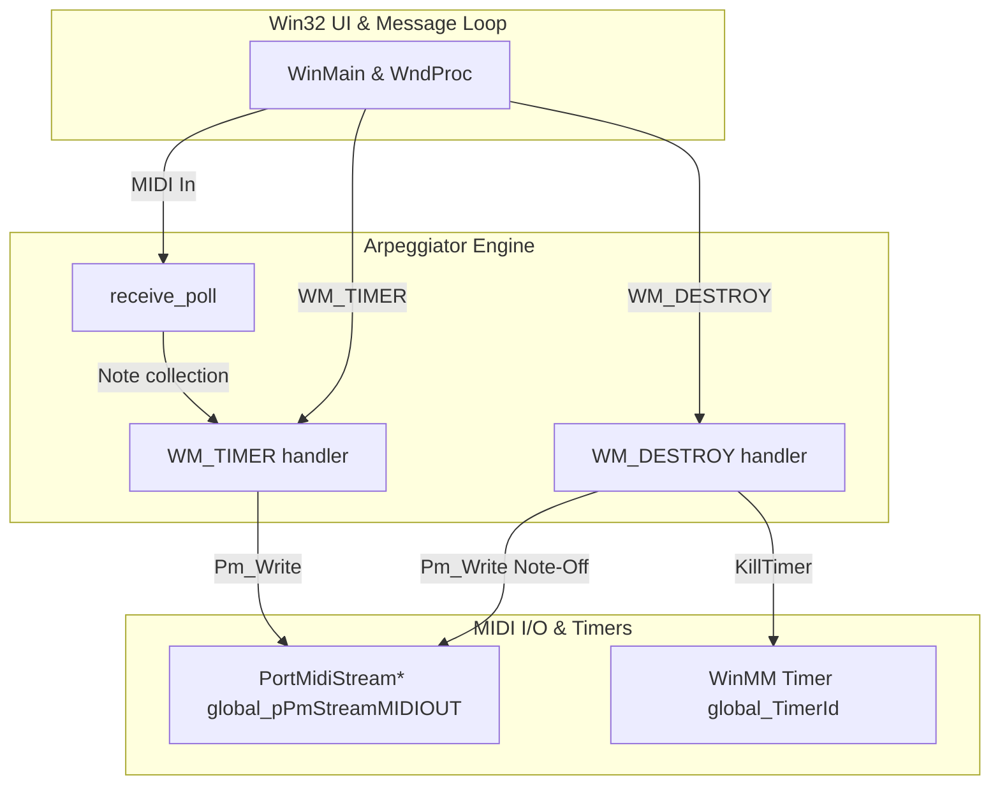
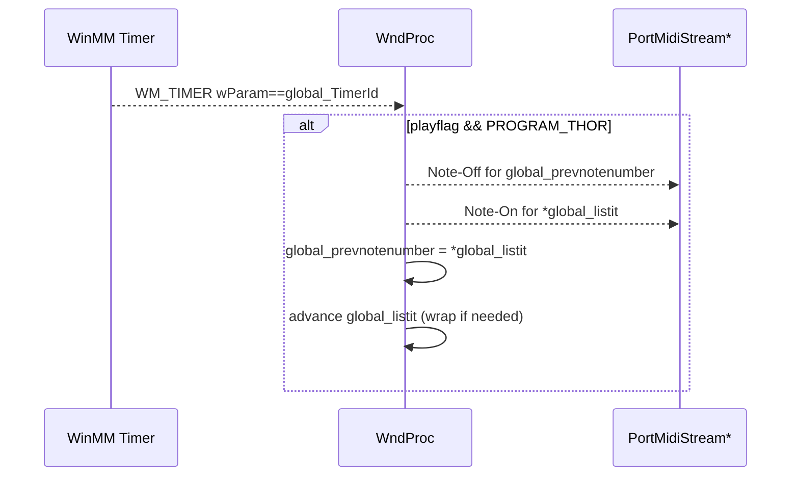
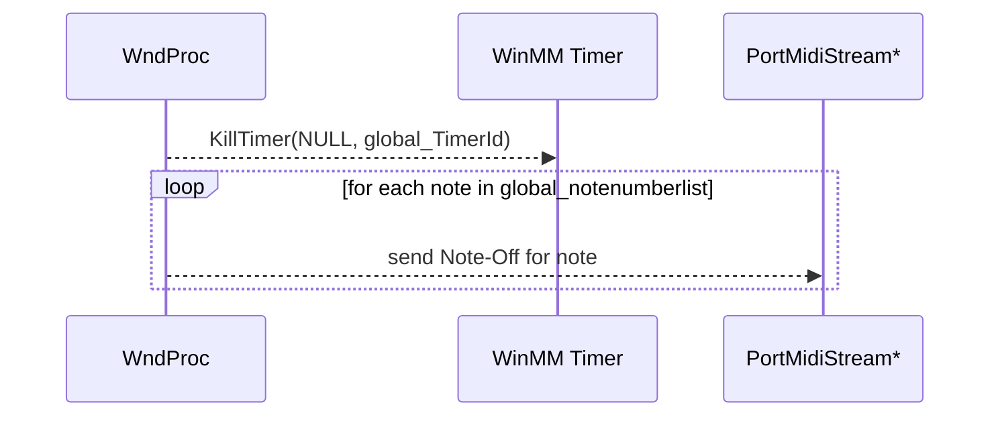

# Using the Arpeggiator (Core User Workflows) – Arpeggiation Mode: THOR

## Overview

The THOR arpeggiation mode provides a list-based sequencing of incoming MIDI notes, ensuring that each new note replaces the previous one cleanly. As you hold down one or more keys, THOR cycles through the collected notes one at a time, turning off the prior note before issuing the next Note-On. On exit, it gracefully shuts down by sending Note-Off for every note still in the list, preventing “stuck” notes.

This mode is valuable when you want a monophonic, rotating arpeggio that never overlaps voices. THOR fits into the core arpeggiator application as one of several selectable programs (PROGRAM_THOR) implemented in `spimidiarpeggiator_polywin32.cpp`, leveraging PortMidi for I/O and WinMM timers for scheduling.

## Architecture Overview

## Component Structure

### 1. Core Arpeggiator Engine

#### spimidiarpeggiator_polywin32.cpp

- **Location:** repository root
- **Purpose:**
- Opens and manages MIDI input/output via PortMidi
- Polls incoming MIDI events (`receive_poll`)
- Implements multiple arpeggiation modes, including THOR
- Uses a WinMM timer to schedule Note-Off/On events
- Handles shutdown to prevent hanging notes
- **Key Global Variables:**

| Variable | Type | Description |
| --- | --- | --- |
| global_notenumberlist | std::list<int> | List of currently held MIDI note numbers |
| global_listit | std::list<int>::iterator | Iterator over `global_notenumberlist` |
| global_prevnotenumber | int | Previously played note number (–1 if none yet) |
| global_playflag | bool | Indicates if arpeggiation is currently active |
| global_programid | int | Current arpeggiation mode (e.g., PROGRAM_THOR) |
| global_TimerId | UINT_PTR | WinMM timer identifier |
| global_outputmidichannel | int | MIDI output channel offset |
| global_pPmStreamMIDIOUT | PortMidiStream* | Handle for MIDI output stream |

- **Key Functions & Handlers:**
- `receive_poll(PtTimestamp, void*)`

• Reads incoming MIDI events, detects Note-On/Off, and populates `global_notenumberlist` when PROGRAM_THOR is selected.

- `WndProc(... WM_TIMER ...)`

• On `WM_TIMER` for `global_TimerId`, advances the THOR sequence: turns off the previous note, turns on the next, updates `global_prevnotenumber` and `global_listit`.

- `WndProc(... WM_DESTROY ...)`

• Kills the arpeggiator timer and iterates `global_notenumberlist` to send Note-Off for each remaining note.

### 2. Arpeggiation Mode: THOR

#### Behavior

- **List-Based Sequencing**

Incoming Note-On events append to `global_notenumberlist`. Notes are never polyphonically overlapped.

- **Explicit Previous-Note Tracking**

`global_prevnotenumber` holds the last-played note number. On each timer tick:

1. Send Note-Off for `global_prevnotenumber`
2. Send Note-On for the next note (`*global_listit`)
3. Update `global_prevnotenumber` to the current note
4. Advance `global_listit`, wrapping to `begin()` at end
5. **Shutdown Cleanup**

On WM_DESTROY when `global_programid == PROGRAM_THOR`, the application:

1. Calls `KillTimer(NULL, global_TimerId)`
2. Iterates through every note in `global_notenumberlist`
3. Sends a Note-Off (`velocity = 0`) for each, ensuring no hanging notes remain

#### Sequence Diagram: THOR Tick Handling

#### Sequence Diagram: THOR Shutdown Cleanup

## State Management

- **global_playflag**

• `true` when arpeggiation is active; only in this state does the WM_TIMER handler process notes.

- **global_programid**

• Determines mode. THOR is active when `global_programid == PROGRAM_THOR`.

## Dependencies

- **PortMidi / PortTime**

• `Pm_Write`, `Pm_Message`, `Pm_Read` for MIDI I/O

• `Pt_Start`, `Pt_Stop` for polling (not shown in THOR logic excerpt)

- **WinMM Timers**

• `SetTimer`, `KillTimer` for scheduling the arpeggio tick

- **spiwavsetlib**

• `StatusAddText` / `StatusAddTextA` for on-screen status and logging

## Testing Considerations

- Verify that on each tick, the previous note is turned off before the next note is turned on.
- Confirm iterator wrapping when the list end is reached.
- Ensure that on exit (WM_DESTROY), all notes in `global_notenumberlist` receive Note-Off and no notes hang.
- Test rapid addition/removal of notes to `global_notenumberlist` to validate iterator stability.

## Key Variables Reference

| Variable | Responsibility |
| --- | --- |
| global_notenumberlist | Holds active MIDI notes for THOR sequencing |
| global_listit | Iterator over the note list |
| global_prevnotenumber | Tracks the last-played note to issue Note-Off |
| global_TimerId | Identifier for the WinMM arpeggiator timer |
| global_playflag | Gatekeeper for whether the WM_TIMER logic runs |
| global_programid | Selects PROGRAM_THOR mode among other arpeggiators |
| global_pPmStreamMIDIOUT | PortMidi stream used to write Note-On/Off messages |

---