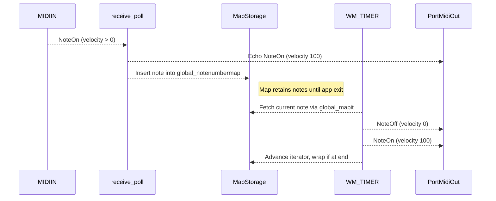

# Using the Arpeggiator (Core User Workflows)

## Arpeggiation Modes: ULTRAMAN

### Overview

In **ULTRAMAN** mode, every incoming Note On is immediately echoed back to the MIDI output and also stored in a map for cyclical retriggering. Unlike GOZILLA, ULTRAMAN ignores Note Off events: notes remain in the internal map until the application shuts down. A Win32 timer (WM_TIMER) drives the arpeggiation by iterating over the stored notes, sending a Note Off then Note On for each in turn.

---

### Note-On Handling in receive_poll()

When a Note On arrives (`msgstatus` ≥ MIDI_ON_NOTE, velocity ≠ 0), **receive_poll()** performs two actions for ULTRAMAN:

1. **Immediate Echo**

It sends the exact Note On message back out on the MIDI output channel:

```cpp
   tempPmEvent.timestamp = 0;
   tempPmEvent.message   = Pm_Message(0x90 + global_outputmidichannel,
                                      notenumber, 100);
   Pm_Write(global_pPmStreamMIDIOUT, &tempPmEvent, 1);
```

1. **Map-Based Storage**

It inserts the new key into a `std::map<int,int> global_notenumbermap`, resetting the map iterator to `begin()`:

```cpp
   global_notenumbermap.insert(pair<int,int>(notenumber,0));
   global_mapit = global_notenumbermap.begin();
```

ULTRAMAN does **not** remove notes on receiving a Note Off—released keys persist in the map.

---

### Timer-Driven Retriggering (WM_TIMER)

A Win32 timer (`global_TimerId`) fires at the user-configured tempo. In the `WM_TIMER` handler, ULTRAMAN shares its branch with GOZILLA but without removal logic:

```cpp
if (global_programid==PROGRAM_GOZILLA || global_programid==PROGRAM_ULTRAMAN) {
    if (global_notenumbermap.size()>0) {
        int notenumber = global_mapit->first;
        // 1) Note Off
        tempPmEvent.timestamp = 0;
        tempPmEvent.message   = Pm_Message(0x90 + global_outputmidichannel,
                                           notenumber, 0);
        Pm_Write(global_pPmStreamMIDIOUT, &tempPmEvent, 1);
        // 2) Note On
        tempPmEvent.timestamp = 0;
        tempPmEvent.message   = Pm_Message(0x90 + global_outputmidichannel,
                                           notenumber, 100);
        Pm_Write(global_pPmStreamMIDIOUT, &tempPmEvent, 1);
        // 3) Advance iterator, wrap at end
        global_mapit++;
        if (global_mapit == global_notenumbermap.end())
            global_mapit = global_notenumbermap.begin();
    }
}
```

---

### Behavioral Differences from GOZILLA

- **Immediate Echo**

ULTRAMAN echoes each Note On as it arrives. GOZILLA inserts notes into the map but does  send an immediate Note On in `receive_poll()`.

- **Note-Off Ignored**

ULTRAMAN leaves notes in the map on key release; GOZILLA responds to Note Off by sending a Note Off through the output and erasing that key from the map.

- **Persisting Arpeggio Set**

Because ULTRAMAN never removes a key on release, the arpeggio will continuously cycle through every note you’ve played since startup.

---

### Sequence of Operations



---

### Key Variables

| Variable | Role |
| --- | --- |
| `global_notenumbermap` | `std::map<int,int>` storing active notes for ULTRAMAN and GOZILLA modes |
| `global_mapit` | Iterator pointing to the current note in `global_notenumbermap` |
| `global_programid` | Indicates current mode (`PROGRAM_ULTRAMAN` == 1 for ULTRAMAN) |
| `global_outputmidichannel` | MIDI channel used for all arpeggiated output |
| `global_playflag` | If `false`, timer handler skips all retriggering |


---

### Summary

ULTRAMAN mode delivers an ever-growing arpeggio: every note you strike is immediately heard and then woven into a looping map of pitches, retriggered at the set tempo. It differs from GOZILLA by echoing notes on arrival and ignoring releases, creating a sustained, evolving texture until the app is closed.