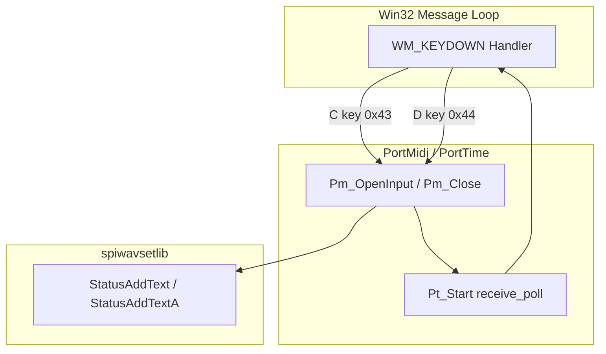
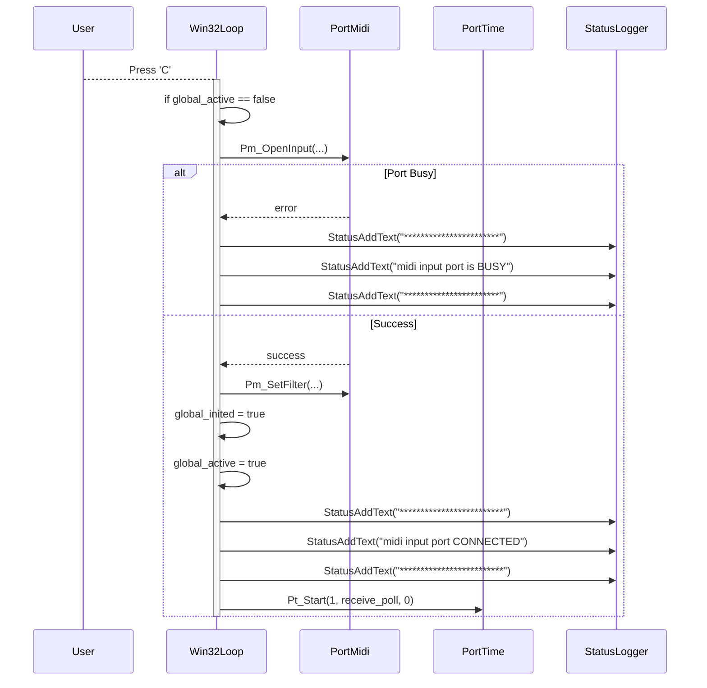
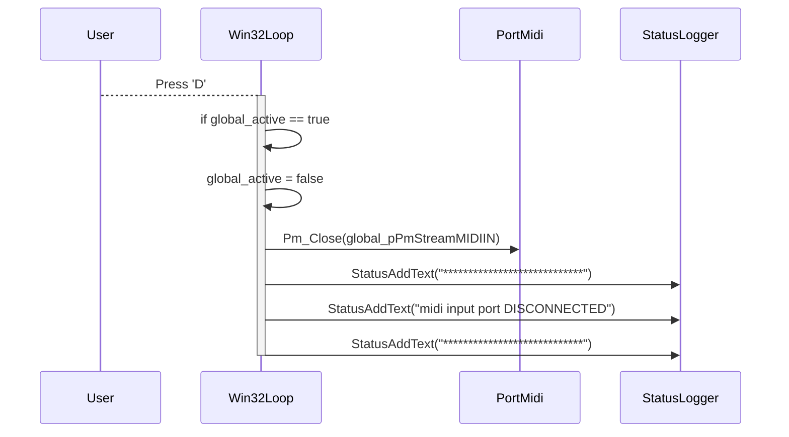

# Using the Arpeggiator (Core User Workflows) – Connecting/Disconnecting MIDI Input at Runtime (Keyboard Shortcuts)

## Overview

This workflow enables the user to open or close the MIDI input port on‐the‐fly without restarting the application.

- Pressing C when no MIDI input is connected will attempt to open the selected input device.
- Pressing D when a device is active will close it.

Feedback is delivered immediately via on‐screen status text (and logged to output.txt) so the user always knows whether the port is busy, connected, or disconnected. Internally, opening and closing the port toggles the global polling loop that reads incoming MIDI messages.

## Architecture Overview



## Component Structure

### Keyboard Shortcut Handler

**File:** `spimidiarpeggiator_polywin32.cpp`

Within the Win32 message loop, WM_KEYDOWN events for ‘C’ (0x43) and ‘D’ (0x44) are handled:

- Checks the current value of `global_active` to decide whether to connect or disconnect.
- Calls PortMidi API functions (`Pm_OpenInput`, `Pm_Close`) to manage the port.
- Uses `StatusAddText` / `StatusAddTextA` to display and log status messages.
- Updates global state flags (`global_inited`, `global_active`).

#### C Key: Connect MIDI Input

- Condition: `global_active == false`
- Action:
- Call `Pm_OpenInput(&global_pPmStreamMIDIIN, global_inputmidideviceid, NULL, 512, NULL, NULL)`
- On error (port busy):
- Display:

```plaintext
       ***********************
       midi input port is BUSY
       ***********************
```

- `global_active` remains `false`.
- On success:
- Call `Pm_SetFilter(global_pPmStreamMIDIIN, filter)`
- Set `global_inited = true`
- Set `global_active = true`
- Display:

```plaintext
       *************************
       midi input port CONNECTED
       *************************
```

#### D Key: Disconnect MIDI Input

- Condition: `global_active == true`
- Action:
- Set `global_active = false`
- Call `Pm_Close(global_pPmStreamMIDIIN)`
- Display:

```plaintext
     ****************************
     midi input port DISCONNECTED
     ****************************
```

## Feature Flows

### Connecting MIDI Input



### Disconnecting MIDI Input



## State Management

- **global_inited** (bool): Set to true when a MIDI input port has been successfully opened and filtered.
- **global_active** (bool): Indicates whether MIDI polling is active.
- `false`: No active input; pressing C attempts connection.
- `true`: Input is active; pressing D disconnects.

## Dependencies

- **PortMidi / PortTime**: Core MIDI I/O and polling.
- **winmm timers**: Scheduling for `receive_poll` callback.
- **spiwavsetlib**: On‐screen status text and logging to *output.txt*.

## Key Code Reference

| File | Responsibility |
| --- | --- |
| spimidiarpeggiator_polywin32.cpp | Implements Win32 message loop, keyboard shortcuts, MIDI port control |
| output.txt | Sample runtime log of status messages |
