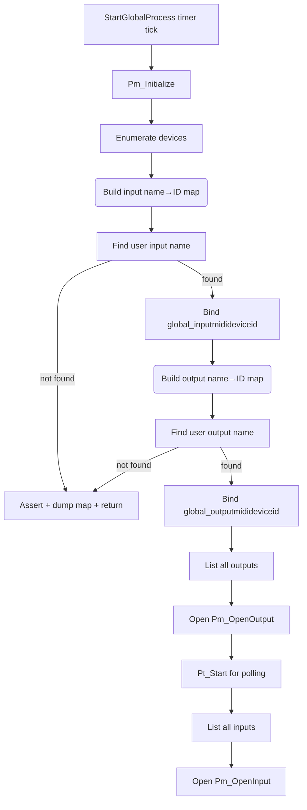

# Using the Arpeggiator (Core User Workflows) – MIDI Device Discovery and Selection by Name

## Overview

Before the arpeggiator can send or receive MIDI data, it must discover available MIDI endpoints on the host system and bind to the ones specified by the user (by name). This process happens once when the global timer callback `StartGlobalProcess()` runs. It:

- Enumerates all PortMidi devices.
- Builds two maps (name → device ID) for inputs and outputs.
- Looks up the user-provided device names in those maps.
- Binds `global_inputmidideviceid` and `global_outputmidideviceid` accordingly.
- Prints status messages listing available devices and confirming selections.

If a named device is not found, the app asserts and dumps the full map of known device names with IDs so the user can correct their configuration.

## Dependencies

- **PortMidi** – used for querying (`Pm_CountDevices`, `Pm_GetDeviceInfo`) and opening streams.
- **PortTime** – starts the poll timer (`Pt_Start`) after input selection.
- **winmm** – timers drive `StartGlobalProcess`.
- **spiwavsetlib** – `StatusAddTextA`/`StatusAddText` for on-screen and log output.
- **C runtime** – `sprintf`/`swprintf` for formatting status text.

## Process Flow



## Device Enumeration and Mapping

Within `StartGlobalProcess()` the app first initializes PortMidi and then counts devices:

```cpp
Pm_Initialize();
int numDevices = Pm_CountDevices();
```

### Building the Input Map

```cpp
for (int i = 0; i < numDevices; i++) {
    const PmDeviceInfo* deviceInfo = Pm_GetDeviceInfo(i);
    if (deviceInfo->input) {
        string name = deviceInfo->name;
        global_inputmididevicemap.insert({ name, i });
    }
}
```

- Iterates all devices.
- Checks `deviceInfo->input`.
- Inserts `(device name) → (device ID i)` into `global_inputmididevicemap`.

### Building the Output Map

Later, the same pattern is used for outputs:

```cpp
for (int i = 0; i < numDevices; i++) {
    const PmDeviceInfo* deviceInfo = Pm_GetDeviceInfo(i);
    if (deviceInfo->output) {
        string name = deviceInfo->name;
        global_outputmididevicemap.insert({ name, i });
    }
}
```

- Checks `deviceInfo->output`.
- Populates `global_outputmididevicemap`.

## Selecting by Name

The desired device names come from two globals:

```cpp
string global_inputmididevicename;   // e.g. "Q49"
string global_outputmididevicename;  // e.g. "Out To MIDI Yoke:  1"
```

### Input Device Selection

```cpp
auto it = global_inputmididevicemap.find(global_inputmididevicename);
if (it != global_inputmididevicemap.end()) {
    global_inputmidideviceid = it->second;
    StatusAddTextA("INPUT:\n");
    StatusAddTextA(global_inputmididevicename.c_str());
    StatusAddTextA("\n");
    // Also prints the channel number...
} else {
    assert(false);
    dumpMap(global_inputmididevicemap);
    StatusAddText(L"input midi device not found\n");
    return;
}
```

- Looks up the user’s input name.
- On success: sets `global_inputmidideviceid` and prints name+channel.
- On failure: `assert(false)`, dumps every entry in `global_inputmididevicemap`, prints an error, and returns early—aborting MIDI setup.

### Output Device Selection

```cpp
it = global_outputmididevicemap.find(global_outputmididevicename);
if (it != global_outputmididevicemap.end()) {
    global_outputmidideviceid = it->second;
    StatusAddTextA("OUTPUT:\n");
    StatusAddTextA(global_outputmididevicename.c_str());
    StatusAddTextA("\n");
    // Also prints the channel number...
} else {
    assert(false);
    dumpMap(global_outputmididevicemap);
    StatusAddText(L"output midi device not found\n");
    // Note: does not return here, but subsequent open will fail
}
```

- Mirrors input logic.
- If not found, asserts and dumps the output map.

## Listing and Opening Devices

After selecting by name, the app lists every device of each type with its ID, interface, and name:

```cpp
StatusAddText(L"MIDI output devices:\n");
for (int i = 0; i < Pm_CountDevices(); i++) {
    const PmDeviceInfo* info = Pm_GetDeviceInfo(i);
    if (info->output) {
        sprintf(pCHAR, "%d: %s, %s\n", i, info->interf, info->name);
        StatusAddTextA(pCHAR);
    }
}
StatusAddText(L"device %d selected\n", global_outputmidideviceid);
Pm_OpenOutput(&global_pPmStreamMIDIOUT, global_outputmidideviceid, NULL, 512, NULL, NULL, 0);
```

- Lists all outputs then confirms which ID was chosen.
- Calls `Pm_OpenOutput` on the selected ID (0-latency).

Similarly for inputs:

```cpp
StatusAddText(L"MIDI input devices:\n");
for (int i = 0; i < Pm_CountDevices(); i++) {
    const PmDeviceInfo* info = Pm_GetDeviceInfo(i);
    if (info->input) {
        sprintf(pCHAR, "%d: %s, %s\n", i, info->interf, info->name);
        StatusAddTextA(pCHAR);
    }
}
StatusAddText(L"device %d selected\n", global_inputmidideviceid);
Pm_OpenInput(&global_pPmStreamMIDIIN, global_inputmidideviceid, NULL, 512, NULL, NULL);
Pt_Start(1, receive_poll, 0);
```

- Opens input stream.
- Starts PortTime polling to handle incoming MIDI.

## Handling Missing Device Names

- On either input or output lookup failure, `assert(false)` triggers a debug break.
- The code then iterates the entire map:

```cpp
  for (auto &entry : global_inputmididevicemap)
      StatusAddTextA(entry.first.c_str() + " maps to " + to_string(entry.second));
```

- Finally, it prints a wide-string error: `"input midi device not found\n"` or `"output midi device not found\n"`.
- For input failure, `StartGlobalProcess()` returns early; output failure proceeds but the subsequent `Pm_OpenOutput` will error and log via `Pm_GetErrorText`.

## Verifying Selection in Status Output

In the log (`output.txt`), you will see blocks like:

```plaintext
OUTPUT:
Out To MIDI Yoke:  1
1

MIDI output devices:
0: MMSystem, Microsoft MIDI Mapper
12: MMSystem, Microsoft GS Wavetable Synth
13: MMSystem, Out To MIDI Yoke:  1
...
device 13 selected
```

and later:

```plaintext
MIDI input devices:
1: MMSystem, In From MIDI Yoke:  1
...
11: MMSystem, Q49
device 11 selected
```

- The “device X selected” lines confirm that the name lookup mapped to the correct numeric ID.
- Use these lines to verify you configured `global_inputmididevicename` and `global_outputmididevicename` correctly.

---

This workflow ensures that users can specify human-readable device names in configuration, and the arpeggiator will reliably bind to the correct PortMidi device IDs at runtime.