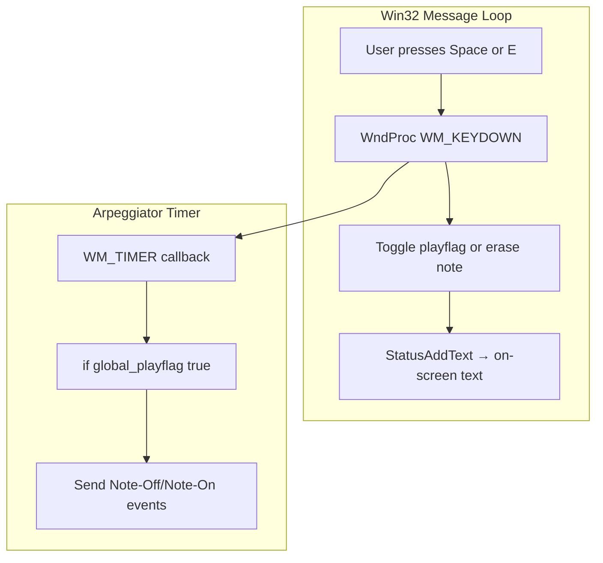
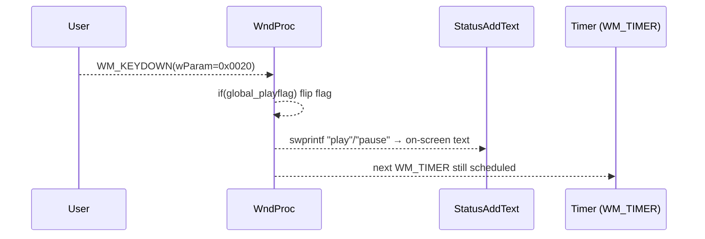
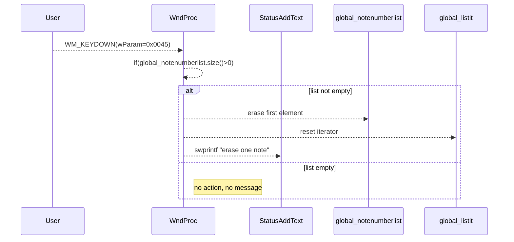

# Using the Arpeggiator (Core User Workflows) - Play/Pause and Live Note Management (Space and E keys)

## Overview

This section describes how end-users control the built-in arpeggiator in `spimidiarpeggiator_polywin32` at runtime via the keyboard.

- Pressing the Space bar toggles arpeggiator playback on and off by flipping the internal `global_playflag`.
- Pressing the E key removes one note from the active note list when using list-based modes (AVATAR or THOR).

These simple, realtime controls let performers start or stop the arpeggiator stream and prune held notes on the fly without restarting the application or changing modes.

## Architecture Overview



## Component Structure

### Presentation Layer

#### **WndProc**

- **Purpose and responsibilities**

Handles all Windows messages, including keyboard input, MIDI I/O, and timer events for arpeggiation.

- **Key Methods and Message Cases**
- WM_KEYDOWN → space bar (0x0020) toggles play/pause
- WM_KEYDOWN → E key (0x0045) erases one note from the active list
- WM_TIMER → drives the arpeggiator when `global_playflag` is true

#### Message-Handling Snippets

```cpp
case WM_KEYDOWN:
    if(wParam==0x0020) // space bar
    {
        // toggle play/pause
        if(global_playflag)
        {
            swprintf(pWCHAR, L"pause\n"); StatusAddText(pWCHAR);
            global_playflag = false;
        }
        else
        {
            swprintf(pWCHAR, L"play\n"); StatusAddText(pWCHAR);
            global_playflag = true;
        }
    }
    else if(wParam==0x0045) // E key
    {
        // erase one note
        if(global_notenumberlist.size()>0)
        {
            swprintf(pWCHAR, L"erase one note\n"); StatusAddText(pWCHAR);
            global_notenumberlist.erase(global_notenumberlist.begin());
            global_listit = global_notenumberlist.begin();
        }
    }
    break;
```

## Feature Flows

### 1. Play/Pause Toggle

When the performer hits the Space bar:



- **Behavior**
- On first Space press: `global_playflag` goes from true → false, arpeggiator suspends.
- On next Space press: `global_playflag` goes from false → true, arpeggiator resumes immediately.

### 2. Live Note Management (Erase Note)

Applicable in list-based programs (AVATAR, THOR):



- **Behavior**
- Each E-press removes the oldest stored note from `global_notenumberlist`.
- The on-screen status line logs “erase one note” each time.
- When the list becomes empty, further E-presses have no effect and produce no status text.

## State Management

- **global_playflag** (bool)

Controls whether the arpeggiator’s timer callback sends MIDI events.

- true: timer-driven arpeggiation runs
- false: timer fires but skips sending notes

- **global_notenumberlist** (`std::list<int>`)

Holds the active note sequence for AVATAR and THOR modes.

- `.erase(begin())` removes the oldest note
- Iterator `global_listit` always reset to `begin()` after erasure

## Dependencies

- **PortMidi / PortTime** for low-latency MIDI I/O and polling
- **winmm timers** (`timeSetEvent`) for scheduling the arpeggiator rhythm
- **FreeImage** for optional background image support
- **spiwavsetlib** for rendering status text overlays and logging to `output.txt`

## Key Classes Reference

| Class / Module | Location | Responsibility |
| --- | --- | --- |
| WndProc | spimidiarpeggiator_polywin32.cpp | Handles keyboard, timer, and WM messages |
| Timer Callback | spimidiarpeggiator_polywin32.cpp | Drives note on/off events when playing |
| global_notenumberlist | spimidiarpeggiator_polywin32.cpp (GLobal) | Stores and manages live note sequence |
